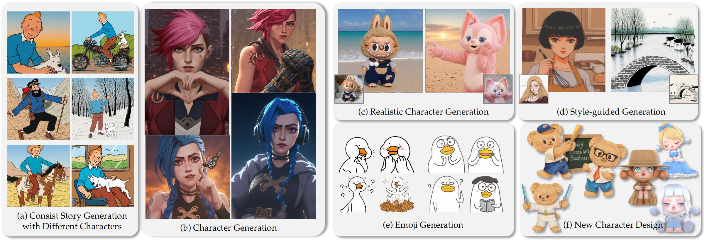

<div id="top"></div>
<!--
*** Thanks for checking out the Best-README-Template. If you have a suggestion
*** that would make this better, please fork the repo and create a pull request
*** or simply open an issue with the tag "enhancement".
*** Don't forget to give the project a star!
*** Thanks again! Now go create something AMAZING! :D
-->


<!-- PROJECT SHIELDS -->
<!--
*** I'm using markdown "reference style" links for readability.
*** Reference links are enclosed in brackets [ ] instead of parentheses ( ).
*** See the bottom of this document for the declaration of the reference variables
*** for contributors-url, forks-url, etc. This is an optional, concise syntax you may use.
*** https://www.markdownguide.org/basic-syntax/#reference-style-links
-->
<!-- [![Contributors][contributors-shield]][contributors-url]
[![Forks][forks-shield]][forks-url]
[![Stargazers][stars-shield]][stars-url]
[![Issues][issues-shield]][issues-url]
[![MIT License][license-shield]][license-url]
[![LinkedIn][linkedin-shield]][linkedin-url] -->


<!-- PROJECT LOGO -->
<br />
<!-- <div align="center">
  <a href="https://github.com/othneildrew/Best-README-Template">
    
  </a>

  <h3 align="center">Best-README-Template</h3>

  <p align="center">
    An awesome README template to jumpstart your projects!
    <br />
    <a href="https://github.com/othneildrew/Best-README-Template"><strong>Explore the docs »</strong></a>
    <br />
    <br />
    <a href="https://github.com/othneildrew/Best-README-Template">View Demo</a>
    ·
    <a href="https://github.com/othneildrew/Best-README-Template/issues">Report Bug</a>
    ·
    <a href="https://github.com/othneildrew/Best-README-Template/issues">Request Feature</a>
  </p>
</div> -->


<!-- TABLE OF CONTENTS -->
<!-- <details>
  <summary>Table of Contents</summary>
  <ol>
    <li>
      <a href="#about-the-project">CAST</a>
      <ul>
        <li><a href="#built-with">Built With</a></li>
      </ul>
    </li>
    <li>
      <a href="#getting-started">Getting Started</a>
      <ul>
        <li><a href="#prerequisites">Prerequisites</a></li>
        <li><a href="#installation">Installation</a></li>
      </ul>
    </li>
    <li><a href="#usage">Usage</a></li>
    <li><a href="#roadmap">Roadmap</a></li>
    <li><a href="#contributing">Contributing</a></li>
    <li><a href="#license">License</a></li>
    <li><a href="#contact">Contact</a></li>
    <li><a href="#acknowledgments">Acknowledgments</a></li>
  </ol>
</details> -->


<!-- ABOUT THE PROJECT -->
# IP-Prompter: Training-Free Theme-Specific Image Generation via Dynamic Visual Prompting



The stories and characters that captivate us as we grow up shape unique fantasy worlds, with images serving as the primary medium for visually experiencing these realms. Personalizing generative models through fine-tuning with theme-specific data has become a prevalent approach in text-to-image generation. However, unlike object customization, which focuses on learning specific objects, theme-specific generation encompasses diverse elements such as characters, scenes, and objects. Such diversity also introduces a key challenge: how to adaptively generate multi-character, multi-concept, and continuous theme-specific images (TSI). Moreover, fine-tuning approaches often come with significant computational overhead, time costs, and risks of overfitting. This paper explores a fundamental question: Can image generation models directly leverage images as contextual input, similarly to how large language models use text as context? To address this, we present IP-Prompter, a novel training-free TSI method for generation. IP-Prompter introduces visual prompting, a mechanism that integrates reference images into generative models, allowing users to seamlessly specify the target theme without requiring additional training. To further enhance this process, we propose a Dynamic Visual Prompting (DVP) mechanism, which iteratively optimizes visual prompts to improve the accuracy and quality of generated images. Our approach enables diverse applications, including consistent story generation, character design, realistic character generation, and style- guided image generation. Comparative evaluations against state-of-the-art personalization methods demonstrate that IP-Prompter achieves significantly better results and excels in maintaining character identity preserving, style consistency and text alignment, offering a robust and flexible solution for theme-specific image generation.

For details see the [paper](https://arxiv.org/abs/2501.15641) 

<p align="right">(<a href="#top">back to top</a>)</p>


<!-- ### Built With -->
<!-- 
This section should list any major frameworks/libraries used to bootstrap your project. Leave any add-ons/plugins for the acknowledgements section. Here are a few examples.

* [Next.js](https://nextjs.org/)
* [React.js](https://reactjs.org/)
* [Vue.js](https://vuejs.org/)
* [Angular](https://angular.io/)
* [Svelte](https://svelte.dev/)
* [Laravel](https://laravel.com)
* [Bootstrap](https://getbootstrap.com)
* [JQuery](https://jquery.com)

<p align="right">(<a href="#top">back to top</a>)</p>
 -->


<!-- GETTING STARTED -->
## Getting Started

### Prerequisites

For packages, see environment.yaml.

  ```sh
  conda env create ip-prompter
  pip install -r requirements.txt
  conda activate ip-prompter
  ```

<p align="right">(<a href="#top">back to top</a>)</p>

### Installation

   Clone the repo
   ```sh
   git clone https://github.com/IP-Prompter/IP-Prompter-code.git
   ```

<p align="right">(<a href="#top">back to top</a>)</p>

### Generation

  To generate new images, run ProSpect.ipynb
  
  #### Instructions

  ```sh
  python inference.py
  ```
  
  `prompt`: text promt that injected into all stages. 
  A '\*' in the `prompt` will be replaced by `prospect_words`, if the `prospect_words` is not None.
  Otherwise, '\*' will be replaced by the learned token embedding.
  
  Edit `prospect_words` to change the prompts injected into different stages. 
  A '\*' in the `prospect_words` will be replaced by the learned token embedding.
  
  For img2img, a `content_dir` to the image, and a `strength` for diffusion are needed.
    
  #### A more detailed example:
  
  Reference Image:
  
  

  **Content-aware T2I generation**
  
  ```sh
  main(prompt = '*', \
        ddim_steps = 50, \
        strength = 0.6, \
        seed=42, \
        height = 512, \
        width = 768, \
        prospect_words = ['a teddy * walking in times square', # 10 generation ends\
                             'a teddy * walking in times square', # 9 \
                             'a teddy * walking in times square', # 8 \
                             'a teddy * walking in times square', # 7 \
                             'a teddy * walking in times square', # 6 \
                             'a teddy * walking in times square', # 5 \
                             'a teddy * walking in times square', # 4 \
                             'a teddy * walking in times square', # 3 \
                             'a teddy walking in times square', # 2 \
                             'a teddy walking in times square', # 1 generation starts\
                            ], \
        model = model,\
        )
  ```
  
  with _ProSpect_:
  
  
  

  **Layout-aware T2I generation**
  
  ```sh
  main(prompt = '*', \
        ddim_steps = 50, \
        strength = 0.6, \
        seed=41, \
        height = 512, \
        width = 512, \
        prospect_words = ['a corgi sits on the table', # 10 generation ends\
                             'a corgi sits on the table', # 9 \
                             'a corgi sits on the table', # 8 \
                             'a corgi sits on the table', # 7 \
                             'a corgi sits on the table', # 6 \
                             'a corgi sits on the table', # 5 \
                             'a corgi sits on the table', # 4 \
                             'a corgi sits on the table', # 3 \
                             'a corgi sits on the table', # 2 \
                             'a corgi sits on the table *', # 1 generation starts\
                            ], \
        model = model,\
        )
  ```
  
  with _ProSpect_:
  
  
  
  without _ProSpect_:
  
  
  
  **Material-aware T2I generation**
  
  ```sh
  main(prompt = '*', \
        ddim_steps = 50, \
        strength = 0.6, \
        seed=42, \
        height = 512, \
        width = 768, \
        prospect_words = ['a * dog on the table', # 10 generation ends\
                             'a * dog on the table', # 9 \
                             'a * dog on the table', # 8 \
                             'a * dog on the table', # 7 \
                             'a * dog on the table', # 6 \
                             'a dog on the table', # 5 \
                             'a dog on the table', # 4 \
                             'a dog on the table', # 3 \
                             'a dog on the table', # 2 \
                             'a dog on the table', # 1 generation starts\
                            ], \
        model = model,\
        )
  ```
  
  with _ProSpect_:
  
  
  
  without _ProSpect_:
  
  
   
  There are 4 ways to use _ProSpect_
  
  1.Image editing: In img2img mode, modify the content, material, and style of the original image.
  
  2.Prompt-to-prompt editing: No need to learn token embedding *, in txt2img mode, use text to guide image generation, modify prompts at different stages to modify different attributes of generated images.
  
  3.Attribute guidance: In txt2img mode, first learn token embedding *. Use * to represent the learned image concept and control the image attributes corresponding to different stages.
  
  4.Flexible attribute guidance: In txt2img mode, learn token embedding * first. When an item of the input list 'prospect_words' is an int type of 0-9, the token embedding at this position will be replaced with the learned token embedding * at the corresponding position.
  
  Enjoy!


  

<p align="right">(<a href="#top">back to top</a>)</p>

### Data

Download the training images [here](https://drive.google.com/file/d/1ZcC_YhGsvN0yD8trSIJjVBUaAZV0TjQf/view?usp=sharing)(8.1M). 

<p align="right">(<a href="#top">back to top</a>)</p>

## Prompt Spectrum Space


Differences between (a) standard textual conditioning P and (c) the proposed prompt spectrum conditioning P*. Instead of learning global textual conditioning for the whole diffusion process, _ProSpect_ obtains a set of different token embeddings delivered from different denoising stages.
Textual Inversion loses most of the fidelity.
Compared with DreamBooth that generates cat-like objects in the images, _ProSpect_ can separate content and material, and is more fit for attribute-aware T2I image generation.

### Motivation


Experimental results showing that different attributes exist at different steps.
(a) Results of removing prompts 'a profile of a furry parrot' of different steps.
(b) Results of adding material attribute 'yarn' and color attribute 'blue'.
(c) Results of removing style attribute 'Monet' and 'Picasso'.


The visualization results of token embeddings _𝑝𝑖_ obtained by _ProSpect_. 
The results show that the initial generation step of the diffusion model is sensitive to structural information (e.g., bird’s pose, pot’s shape). 
As the number of steps increases, the obtained 𝑝𝑖 gradually captures detailed information (e.g., the sideways head of the bird → bird’s wing → the texture of the bird’s feathers).

### Attribute-aware Image Generation with _ProSpect_

## Content-aware Image Generation


Comparisons with state-of-the-art personalization methods including Textual Inversion (TI), DreamBooth, XTI, and Perfusion.
The **bold** words correspond to the additional concepts added to each image, (e.g. the 3rd column in (a) shows the result of 'A standing cat in a chef outfit', the 6th column in (b) shows the result of 'A tilting cat wearing sunglasses').
The resulting images of XTI and Perfusion are borrowed from their paper, so the results of adding concepts are not shown.
Our method is faithful to convey the appearance and material of the reference image while having better controllability and diversity.


## Material-aware Image Generation


## Style-aware Image Generation


## Layout-aware Image Generation


## Multiple Attribute-Aware Image Generation


### Citation
   
   ```sh
   @article{zhang2023prospect,
  title={ProSpect: Prompt Spectrum for Attribute-Aware Personalization of Diffusion Models},
  author={Zhang, Yuxin and Dong, Weiming and Tang, Fan and Huang, Nisha and Huang, Haibin and Ma, Chongyang and Lee, Tong-Yee and Deussen, Oliver and Xu, Changsheng},
  journal={ACM Transactions on Graphics (TOG)},
  volume={42},
  number={6},
  pages={244:1--244:14},
  year={2023},
  publisher={ACM New York, NY, USA}
}
   ```
   
<p align="right">(<a href="#top">back to top</a>)</p>


<!-- 
<!-- USAGE EXAMPLES -->
<!-- ## Usage

Use this space to show useful examples of how a project can be used. Additional screenshots, code examples and demos work well in this space. You may also link to more resources.

_For more examples, please refer to the [Documentation](https://example.com)_

<p align="right">(<a href="#top">back to top</a>)</p> -->


<!-- ROADMAP -->
<!-- ## Roadmap

- [x] Add Changelog
- [x] Add back to top links
- [ ] Add Additional Templates w/ Examples
- [ ] Add "components" document to easily copy & paste sections of the readme
- [ ] Multi-language Support
    - [ ] Chinese
    - [ ] Spanish

See the [open issues](https://github.com/othneildrew/Best-README-Template/issues) for a full list of proposed features (and known issues).

<p align="right">(<a href="#top">back to top</a>)</p> -->


<!-- CONTRIBUTING -->
<!-- ## Contributing -->

<!-- Contributions are what make the open source community such an amazing place to learn, inspire, and create. Any contributions you make are **greatly appreciated**.

If you have a suggestion that would make this better, please fork the repo and create a pull request. You can also simply open an issue with the tag "enhancement".
Don't forget to give the project a star! Thanks again!

1. Fork the Project
2. Create your Feature Branch (`git checkout -b feature/AmazingFeature`)
3. Commit your Changes (`git commit -m 'Add some AmazingFeature'`)
4. Push to the Branch (`git push origin feature/AmazingFeature`)
5. Open a Pull Request
 -->
<!-- <p align="right">(<a href="#top">back to top</a>)</p> -->


<!-- LICENSE -->
<!-- ## License -->
<!-- 
Distributed under the MIT License. See `LICENSE.txt` for more information.
 -->
<!-- <p align="right">(<a href="#top">back to top</a>)</p> -->


<!-- CONTACT -->
## Contact

Please feel free to open an issue or contact us personally if you have questions, need help, or need explanations. Write to one of the following email addresses, and maybe put one other in the cc:

zhangyuxin2020@ia.ac.cn


<!-- 
Your Name - [@your_twitter](https://twitter.com/your_username) - email@example.com

Project Link: [https://github.com/your_username/repo_name](https://github.com/your_username/repo_name)
 -->
<p align="right">(<a href="#top">back to top</a>)</p>


<!-- ACKNOWLEDGMENTS -->
<!-- ## Acknowledgments -->
<!-- 
Use this space to list resources you find helpful and would like to give credit to. I've included a few of my favorites to kick things off!

* [Choose an Open Source License](https://choosealicense.com)
* [GitHub Emoji Cheat Sheet](https://www.webpagefx.com/tools/emoji-cheat-sheet)
* [Malven's Flexbox Cheatsheet](https://flexbox.malven.co/)
* [Malven's Grid Cheatsheet](https://grid.malven.co/)
* [Img Shields](https://shields.io)
* [GitHub Pages](https://pages.github.com)
* [Font Awesome](https://fontawesome.com)
* [React Icons](https://react-icons.github.io/react-icons/search) -->

<!-- <p align="right">(<a href="#top">back to top</a>)</p> -->


<!-- MARKDOWN LINKS & IMAGES -->
<!-- https://www.markdownguide.org/basic-syntax/#reference-style-links -->
[contributors-shield]: https://img.shields.io/github/contributors/othneildrew/Best-README-Template.svg?style=for-the-badge
[contributors-url]: https://github.com/othneildrew/Best-README-Template/graphs/contributors
[forks-shield]: https://img.shields.io/github/forks/othneildrew/Best-README-Template.svg?style=for-the-badge
[forks-url]: https://github.com/othneildrew/Best-README-Template/network/members
[stars-shield]: https://img.shields.io/github/stars/othneildrew/Best-README-Template.svg?style=for-the-badge
[stars-url]: https://github.com/othneildrew/Best-README-Template/stargazers
[issues-shield]: https://img.shields.io/github/issues/othneildrew/Best-README-Template.svg?style=for-the-badge
[issues-url]: https://github.com/othneildrew/Best-README-Template/issues
[license-shield]: https://img.shields.io/github/license/othneildrew/Best-README-Template.svg?style=for-the-badge
[license-url]: https://github.com/othneildrew/Best-README-Template/blob/master/LICENSE.txt
[linkedin-shield]: https://img.shields.io/badge/-LinkedIn-black.svg?style=for-the-badge&logo=linkedin&colorB=555
[linkedin-url]: https://linkedin.com/in/othneildrew
[product-screenshot]: images/screenshot.png
